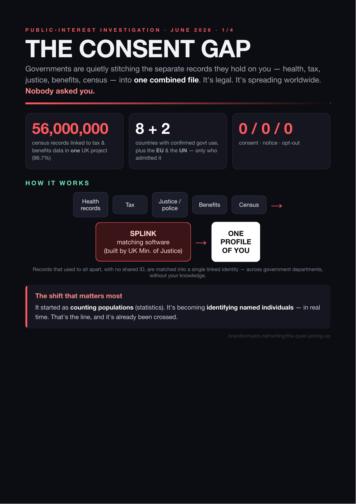

# How Splink Works: No Hack, No Consent, No Opt-Out

**Public-interest investigation · How it works (visual) · June 2026**
Published: https://brandonmyers.net/writing/how-splink-works
Graphic: [`how-splink-works-graphic.png`](how-splink-works-graphic.png) · screenshot: [`screenshots/22-PUBLISHED-how-splink-works.png`](screenshots/22-PUBLISHED-how-splink-works.png)

The short, visual version of the series. The whole machine in one picture.

## In one line
Splink takes records that were never meant to be joinable — your health, tax, justice, benefits and census records, in separate systems with **no shared ID** — and matches them, probabilistically, into **one linked profile of you**. Free, open-source, built by the **UK Ministry of Justice**.

## No hack
Nothing here is a breach, a leak, or a hack. The maths (Fellegi–Sunter) is mainstream; published accuracy is high; data is handled by vetted researchers, usually de-identified. The concern is not that the tool is broken — it's what an accurate, working version quietly makes possible.

## No consent
There is no consent step because, in law, none is required. Population-scale administrative linkage runs on a statutory **"public task"** basis (e.g. the Digital Economy Act 2017), which does not ask permission. Not a claim anyone broke the rules — **the rules were written to permit it.** You were simply never asked.

## No opt-out
Because the basis is public task, not consent, there is — as a rule — **no individual notification and no right to object.** You are not told your records were stitched into one profile, and in most cases cannot say no.

## The shift that should worry you
It started as a way of counting populations (statistics). The government's own transparency records now describe the same tool running in **courts, in real time**, and being piloted to assign a **single cross-justice identifier to named individuals** — the move from statistics to *operations*. Tracked in [Statistics or Operations?](Ruled-Unlawful-Next-Door-REPORT.md) and at brandonmyers.net/writing/statistics-or-operations.

## And the courts?
No court has ruled Splink, Data First, ONS IDS or ADR UK unlawful — stated plainly. But the *same* shortcut, keeping data-protection safeguards in **policy instead of law**, was struck down by the courts **three times** in the adjacent immigration regime. See [Ruled Unlawful Next Door](Ruled-Unlawful-Next-Door-REPORT.md).

---
*Graphic built from the government's own published documents — GOV.UK Algorithmic Transparency Records (moj-data-first-splink, moj-splink-master-record), the Splink documentation, and ADR UK.*
